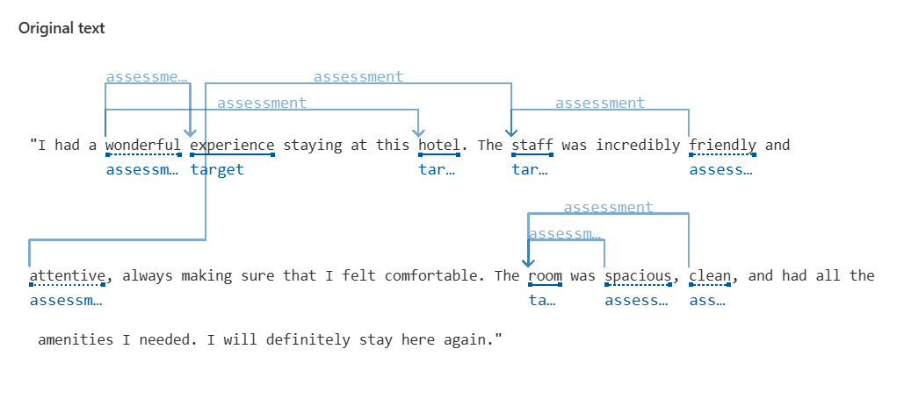
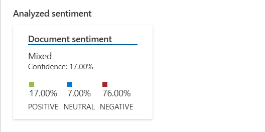
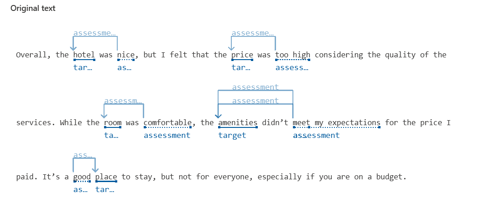
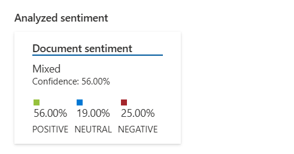
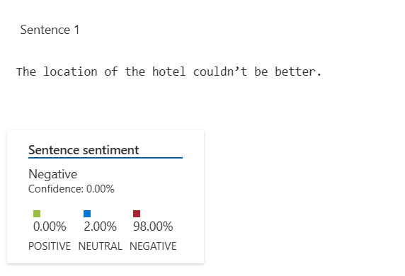

# Análise de Sentimentos com Azure

Esse projeto usa os Serviços Cognitivos da Azure para analisar o sentimento de frases de avaliação. Abaixo estão alguns exemplos de sentenças:

---

## 🏨 Avaliação 1: Experiência Positiva  

### ✍️ Frase Analisada:
> *"I had a wonderful experience staying at this hotel. The staff was incredibly friendly and attentive, always making sure that I felt comfortable. The room was spacious, clean, and had all the amenities I needed. I will definitely stay here again."*

### 📊 Resultado da Análise:

  
  

### 🔎 Observação:
- Percebe-se que a IA analisa a frase e observa as relações entre a entidade avaliada e o adjetivo ou qualificação que é associado a ela.  

---

## 💰 Avaliação 2: Experiência Mista  

### ✍️ Frase Analisada:
> *"Overall, the hotel was nice, but I felt that the price was too high considering the quality of the services. While the room was comfortable, the amenities didn’t meet my expectations for the price I paid. It’s a good place to stay, but not for everyone, especially if you are on a budget."*

### 📊 Resultado da Análise:

  
  

### 🔎 Observação:
- É possível verificar que a IA separa cada sentença e calcula um percentual para cada trecho.  
- A média de todas as frases contribui para a avaliação geral do sentimento.  

---

## 📍 Avaliação 3: Experiência Positiva  

### ✍️ Frase Analisada:
> *"The location of the hotel couldn’t be better. It’s right in the heart of the city, close to all the major attractions and transport options. I could easily walk to restaurants, museums, and parks. It made my trip so much easier and more enjoyable."*

### 📊 Resultado da Análise:

  
  

### 🔎 Observação:
- É interessante observar que ele não conseguiu entender o contexto positivo dessa frase, que fala que 'não poderia ser melhor', o que ele classificou como negativo. A tecnologia ainda precisa de aprimoramento para reconhecer melhor os sentimentos de cada avaliação.

